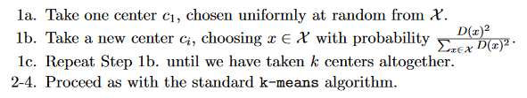

```{r setup, include=FALSE}
knitr::opts_chunk$set(echo = TRUE, warning = FALSE, message = FALSE)
```


### Introduction

K-means is one of the most popular clustering techniques, used by many for a long time. Its simplicity and relative speed are appealing. In various tutorials and articles on the Internet it is constantly listed as the go-to choice for clustering tasks. However, it has its limitations. Some of the them are well known, for example preference for spherical, equally-sized clusters. However, the corectness of the results can be questionable, even in a perfect conditions. In this paper, I have presented potential problems one can meet during applying k-means in standard clustering task. I have also shown an improvement of the algorithm called **k-means++**, which, although less known for R users, usually gives better results and should be considered in analyses. 

### Analysis
#### An example of k-means fault clustering

Below I have created a simple setting to demostrate k-means' pitfalls. In the dataset simulated there are 3 clusters in 2-dimensional space. I have  obtained each cluster by sampling 100 points from gaussian distribution, with $\sigma=1$. I have arbitrarly chosen the centers to make the clusters separable. To simplify the later analyses, I have created a couple of helper functions for mock datasets generation.


```{r, cache=T }
library(tidyverse)
library(kableExtra)
library(factoextra)

create_one_cluster <- function(center, size) {
  # Center - cluster center coordinates, given as list
  # Size - amount of points to create
  # This function creates a set of points following gaussian distribution with sd=1 and cov=0
  # from a set of center coordinates.
  
  center %>% purrr::map(function(x) {
    rnorm(size, mean = x, sd = 1)
  }) %>%
    as.data.frame() -> out
  
  names(out) <- paste0("x", seq_along(names(out)))
  out
}

create_clusters_from_centers <- function(centers, size = 10) {
  # centers - list of centers
  # size - number of points in one cluster
  
  # This function creates a dataset containg multiple clusters.
  # It is a wrapper over create_one_cluster function
  
  centers %>%
    purrr::map(create_one_cluster, size) %>%
    dplyr::bind_rows(.id = "cluster_id")
}


set.seed(10)

cluster_centers <- list(c(1, 10),
                        c(2, 3),
                        c(5, 8))

create_clusters_from_centers(cluster_centers, 100) -> data_with_id

```

Below I have plotted the dataset obtained, with a color being an indication to which cluster a point belongs to.

```{r fig.width=10, cache=T}
ggplot(data_with_id, aes(x = x1, y = x2, color = cluster_id)) +
  geom_point() +
  theme_minimal(base_size = 13) +
  scale_color_brewer(palette = "Set1") +
  coord_fixed() +
  labs(color = "Cluster") +
  scale_x_continuous(breaks = seq(0, 12, 2)) +
  scale_y_continuous(breaks = seq(0, 12, 2))
```

As can be seen, clusters can be easily separated, even using linear boundary. Indeed, running k-means and plotting the output clusters below have provided predicted result.

```{r fig.width=10, cache=T}
data <- data_with_id %>% select(-cluster_id)

kmeans(data, centers = 3) -> results

results %>% 
  fviz_cluster(data, geom = "point") +
  theme_minimal(base_size = 13) +
  scale_color_brewer(palette = "Set1") +
  coord_fixed() +
  labs(title = NULL)

```

The k-means algorithm goal is to minimise sum of total within-sum-of-squares for each cluster. This measure, when calculated on the same dataset with all parameters equal (especially number of clusters), can be used for assessment of clustering quality. In R, that number can be found in `tot.withinss` element of `kmeans` object. In the case of above clustering, the sum of total within sum of squares is `r round(results$tot.withinss,1)`.

K-means is a stochastic algorithm, meaning that two executions of it can give different results. A reasonable thing to check would be testing it stability from run to run. Using the same dataset as above, I have run the algorithm multiple times, and checked how *tot.withinss* behaved. The histogram below shows within-sum-of-squares value for all runs.

```{r, cache=T}
niter <- 1000
k <- 3

# Standard k means clustering reapeated niter times
map(1:niter, function(x) {
  kmeans(data, centers = k)
}) -> kmeans_results

# saving cluster results to data frame
kmeans_results %>%
  map_df(function(x) {
    broom::glance(x)
  }) -> batch_results_df

batch_results_df$cluster_object <- kmeans_results

batch_results <- batch_results_df

rm(batch_results_df, kmeans_results)

# batch_results %>% 
#   head(5)
```

```{r fig.width=10, cache=T}
ggplot(batch_results, aes(x=tot.withinss))+ 
  geom_histogram(fill = "#377EB8") +
  theme_minimal(base_size = 13) +
  coord_fixed()
```

The majority of clustering results are close to the most optimal one (~600). However, there is also some amount of clusterings with tot.withinss at around 1600. This is how such example clustering looks like:

```{r fig.width=10, cache=T}
batch_results %>%
  filter(tot.withinss > 1000) %>%
  head(1) %>%
  .$cluster_object %>%
  .[[1]] -> bad_clustering

  fviz_cluster(bad_clustering, data = data, geom = "point") +
    theme_minimal(base_size = 13) +
    scale_color_brewer(palette = "Set1") +
    coord_fixed() +
    labs(title = NULL)
```


Clustering in this case is highly suboptimal compared to ground-truth model. The two top clusters were merged into one, and the bottom one got splitted.

#### Possible solutions

As shown above, the results from k-means clustering are not stable and can vary substantially from one run to another. One could wonder, how to overcome these fault clusterings.

First solution is researcher's intuition about the desired result. Sometimes it is possible to *guess* the optimal outcome based on previous Exploratory Data Analysis steps, or compare the results with theoretical assumptions.

When the number of dimensions is small (1-3), it is possible to plot the clustering results and decide whether the clustering is reasonable and whether one should run the algorithm another time and compare the results.

With dimension reduction techniques, such as PCA, t-SNE and MDS, it is theoretically possible to plot every dataset on 2-dimensional surface. However, this should be used with caution, as the results may not reflect the dataset properties [^1].

[^1]: for an example concerning caveats of t-SNE technique, see [here](https://distill.pub/2016/misread-tsne/)

Another way would be to run the algorithm multiple times and choose the result with the best value obtained. However, how to assess if the best result is really close to the global optimum? After enough number of iterations the maximum result will usually converge to the most optimal one, however in the worst case there will be a need to test each set of possible clusters, which is obviously not feasible for even small datasets.

The way to go is sometimes to change the algorithm itself. There are plenty of clustering solutions out there, however each of them has some quirks and optimal use cases, and thus sometimes k-means is still the best option. 

#### Improved algorithm - k-means++

There are some improvements aplied to k-means algorithms. One of such improved solutions was proposed by @arthur2007k. The k-means++ algorithm is a slightly modified k-means. The main part of the logic with iterating over possible centers stays the same. The difference lies in centers initialisation phase. In standard k-means, k centers are randomly chosen from the input dataset. In the paper, the algorithm was defined as follows: 



That is: randomly choose first center. Then, choose next center from the remaining points with probability proportional to distance between this point and previous center. After obtaining all cluster centers process as in standard verion. The intuition is that choosing centers distant from each other is a good thing.

Authors of the paper analitically prove that this algorithm asymptotically gives $O(\log{k})$ better results than random initialisation algorithm. 

#### Methods comparison

To show the performance of k-means++ algorithm, I have applied standard and "++" version on two artificial datasets. I have manipulated 2 parameters of the datasets, namely number of clusters *k* and number of dimensions. 

Specifically, I have created two artificial datasets - one with 3 clusters and 2 dimensions, and the other one with k=10 and 10 dimensions. In both cases, cluster centers were chosen uniformly from a $[0, 500]$ space. The clusters were generated from n-dimensional Gaussian with $cov=0$ and $\sigma = 1$. Each cluster consisted of 100 points. This resulted in two datasets of 300 and 1000 observations, respectively.

As the datasets were artificially generated, I explicitly knew what perfect centers are. To use this fact, I have run k-means with perfect centers passed. This way I was able compare results of clusterings to a perfect benchmark.

In R language, k-means++ is implemented in `flexclust` package. The standard version of the algorithm is defined in `stats::kmeans` function. However, comparing the results of these functions was inconvenient, as `flexclust` is implemented in `S4` classes, and that makes it incompatibile with other clustering packages, `factoextra` for instance. That is one of the reasons why I have copied inner workings of algorithm from `flexclust`, which is defined in package's private function `kmeanspp`. The other reason is that I have also optimised the function to take advantage of vectorised operations. This has given a 4x time improvement compared to an existing version. Both the function for improved algorithm and its usage is presented below.

```{r, cache=T}
kmeanspp <- function(x, k)
{
  # x - dataset 
  # k - number of clusters
  
  x <- as.matrix(x)
  centers <- matrix(0, nrow = k, ncol = ncol(x)) # initialising empty centers matrix
  centers[1, ] <- x[sample(1:nrow(x), 1), , drop = FALSE] # Take first point at random
  target_point <- centers[1L, , drop = FALSE] 
  
  # calculate distance from target_point to each point in the dataset - 
  # this is a two step operation to take advantage of vectorised operations 
  map(1:ncol(x), function(i){
      (x[,i] - target_point[,i]) ^ 2
    }) -> distances_list 
  
  d <- sqrt(Reduce(`+`, distances_list))^2 
  
  for (l in 2:k) { # for remaining centers to choose repeat the procedure
    centers[l, ] <- x[sample(1:nrow(x), 1, prob = d), , drop = FALSE] # Select next point with probability weighted by distance from starting point
    
    target_point <- centers[l, , drop = FALSE]
    
    map(1:ncol(x), function(i){
      (x[,i] - target_point[,i]) ^ 2
    }) -> distances_list
    
    
    arg2 <- sqrt(Reduce(`+`, distances_list))^2
    d <- pmin(d, arg2)
    
  }
  
  # Return centers
  centers
}
```

```{r, cache=T}

kmeans(data, centers = kmeanspp(data, 3))

```


The clusterings took a long time to run. I calculated them once in a separate script and loaded the results below. The simulation codes can be found here ... **dfsd** on my github account. I haven't included them here for clarity.

To check the generated datasets clustering tendency, I have plotted their dissimilarity matrices. For bigger dataset with k = 10 I have selected only a sample of random 100 points for faster plot rendering.


```{r fig.width=10, fig.height=5, cache=T}
load("data/batch_experiments.Rdata")

d <- get_dist(data_k3_n2, 
              method = "euclidean")
fviz_dist(d, show_labels = FALSE) +
  labs(title = "Dissimilarity matrix",
       subtitle = "(n = 2, k= 3)") -> diss_k3_n2

sampled_k10 <- data_k10_n10[sample(1:nrow(data_k10_n10), 100), ]

d <- get_dist(sampled_k10, 
              method = "euclidean")
fviz_dist(d, show_labels = FALSE) +
  labs(title = NULL,
       subtitle = "(n = 10, k= 10)") -> diss_k10_n10


cowplot::plot_grid(diss_k3_n2, diss_k10_n10)

```


Both matrices show well-separated rectagles. This means that the datasets are clusterable. Below I have run k-means algorithm with cluster centers used for data generation to provide ground truth results. 

```{r, cache=T}


results_k10_n10_perfect <- kmeans(data_k10_n10, centers = data_k10_n10_centers)
results_k3_n2_perfect <- kmeans(data_k3_n2, centers = data_k3_n2_centers)

```

Value of *tot.withinss* for dataset with k = 3 is equal to `r round(results_k3_n2_perfect$tot.withinss, 2)`, while for k = 10 - `r round(results_k10_n10_perfect$tot.withinss, 2)`


After assessing that the datasets are well-clusuterable, I have run both versions of the algorithm (standard and "++") on both datasets (with k = 2, 10), for each combination doing 1000 iterations.

Below I have plotted a histogram of total-within-sum-of-squares for a dataset with k = 3, in division for both algorithm versions. Once again, the smaller the value of `tot.withinss` the better. Dashed line presents groud-truth results.


```{r fig.width=10, cache=T}

results_k3_n2 %>%
  mutate(type = "standard") %>%
  rbind(results_k3_n2_pp %>% 
          mutate(type = "++")) %>%
  mutate(type = factor(type, levels = c("standard", "++"))) -> results_k3_n2_all

ggplot(results_k3_n2_all, aes(x = tot.withinss, fill = type, color = type)) +
         geom_histogram(alpha=0.7) +
  geom_vline(xintercept =  round(results_k3_n2_perfect$tot.withinss, 2),
             color = "red", linetype = "dashed") +
  facet_grid(rows = vars(type), scales = "free") +
  theme_minimal(base_size = 13) +
  scale_color_brewer(palette = "Set1") +
  scale_fill_brewer(palette = "Set1") +
  labs(fill = "Algorithm",
       x = "tot.withinss") +
  guides(color = FALSE) +
  scale_x_continuous(labels = function(x) round(x, 2))


```


The results are similar to the ones shown before on smaller dataset. Standard version of the algorithm peforms close-to-optimal in most of the cases. However there are also some fault clusterings. On the contrary, the "++" version works perfectly in all of the cases, and its robust random initialisation phase provides an improvement over standard method. The exact statistics are shown in the table below.

```{r, cache=T}

results_k3_n2_all %>% 
  select(-cluster_object) %>%
  group_by(type) %>%
  summarise(
    min = min(tot.withinss),
    q25 = quantile(tot.withinss, 0.25),
    q50 = quantile(tot.withinss, 0.5),
    q75 = quantile(tot.withinss, 0.75),
    max = max(tot.withinss)
  ) %>% 
  arrange(desc(type)) %>%
  kable() %>%
  kable_styling()
```

The difference in performance is clearly visible. Standard algorithm has failed in at least 25% of the cases, while for "++" version there was not even one fault clustering.

Below I have provided histogram and summary table of within-sum-of-squares for the second dataset with k = 10 clusters. This time, the results are even more in favor of improved algorithm. The standard version is comparable only in <5% of the cases. 

#### {.tabset .tabset-fade}

##### Histograms
```{r fig.width=10, cache=T}

results_k10_n10 %>% 
  mutate(type = "standard") %>%
  rbind(results_k10_n10_pp %>% 
          mutate(type = "++")) %>%
  mutate(type = factor(type, levels = c("standard", "++"))) -> results_k10_n10_all

ggplot(results_k10_n10_all, aes(x = tot.withinss, fill = type, color = type)) +
         geom_histogram(alpha=0.7) +
  geom_vline(xintercept =  round(results_k10_n10_perfect$tot.withinss, 2),
             color = "red", linetype = "dashed") +
  facet_grid(rows = vars(type), scales = "free") +
  theme_minimal(base_size = 13) +
  scale_color_brewer(palette = "Set1") +
  scale_fill_brewer(palette = "Set1") +
  labs(fill = "Algorithm",
       x = "tot.withinss (x 10000)") +
  guides(color = FALSE) +
  scale_x_continuous(labels = function(x) round(x/10000))

```

##### Statistics table
```{r, cache=T}
results_k10_n10_all %>% 
  select(-cluster_object) %>%
  group_by(type) %>%
  summarise(
    min = min(tot.withinss),
    q25 = quantile(tot.withinss, 0.25),
    q50 = quantile(tot.withinss, 0.5),
    q75 = quantile(tot.withinss, 0.75),
    max = max(tot.withinss)
  ) %>% 
  arrange(desc(type)) %>%
  kable() %>%
  kable_styling()
```
####

As can be seen, vast majority of clusterings (>75%) in "++" version were exactly the same as the optimal results. This is not the case with standard version. Actually, results for top 25% of runs are worse than the worst clustering in "++" version.


The k-means++ algorithm seems to be superior in terms of corectness. What are its drawbacks? There is one: speed. As of standard algorithm, the initialisation phase is done in consant time - one should only choose k random points from the dataset. In k-means++, on the contrary, after the first center is chosen, the distance to each of the remaining points are calculated. This means passing the data k times, thus time complexity is $O(k*n)$. I have created a basic benchmark for both algorithms comparison. The results obtained by `microbenchmark` package are shown below:

```{r, cache=T}
standard <- function(){kmeans(data, centers = 3)}
pp <- function(){kmeans(data, centers = kmeanspp(data, 3))}
microbenchmark::microbenchmark(
standard(),
pp()
)

```


The standard function is roughly 2 times faster than k-means++. For some applications, this disqualifies the method. The difference in performance will grow with number of clusters. 

There are some workarounds to make k-means++ faster. One thing is algorithm complexity itself, and the other is actual implementation - implementing it in much faster C or Fortran languages (as the standard `stats::kmeans` function is) would be needed. In the function presented in earlier part of this paper, I have optimised the function compared to `flexclust` implementation using vectorised operations in R. However, that is still not enough to catch up with the original algorithm. 

When speed of execution is important, there is also other proposed improvement of k-means made by @bahmani2012scalable, aimed specifically at big data solutions. The authors show a **k-means||** (parallel) algoirithm. It provides the same improvements in accuracy as k-means++, however it is substantially faster, and can be implemented to leverage multiple threads. 

### Summary

The main goal of this paper was to show common pitfalls in k-means algorithm performance. I have presented the workings of another version of k-means, namely k-means++ algorithm. Based on simulated datasets, I have shown superiority of the improved algorithm in terms of accuracy and robustness for incorrect random initialisation phase. 

For the last words, one could wonder what accounts for such little popularity of improved k-means. In python standard *scikit-learn* machine learning library, the "++" version is used by default, and thus used way more. There is an important lesson to learn from this - one should always question, if the most popular path is really the most optimal one. To all R users - it is sometimes good to walk into *snake's pit* to see what it has to offer ;) 


### References